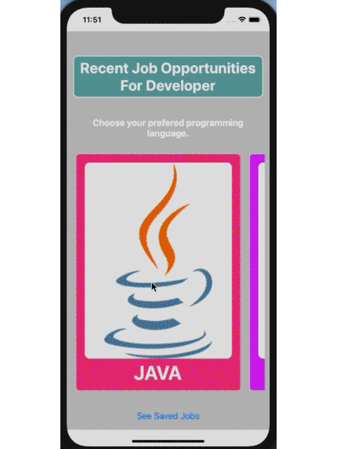
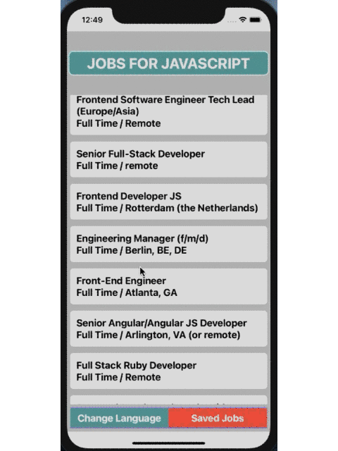
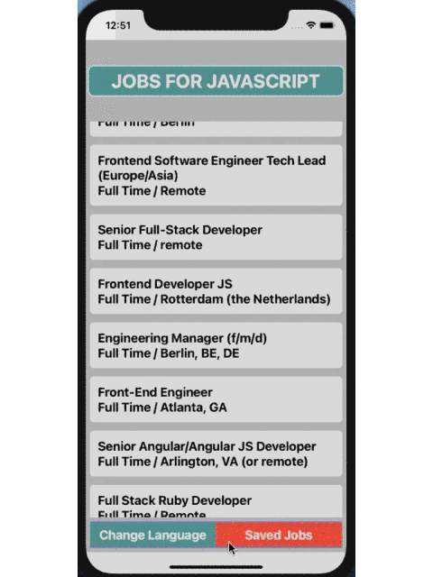
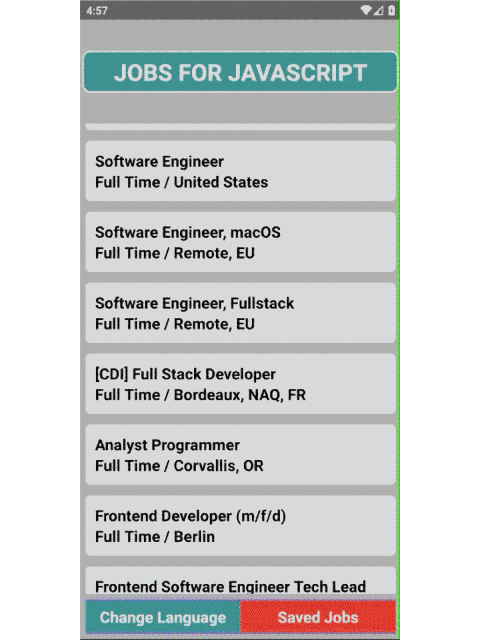
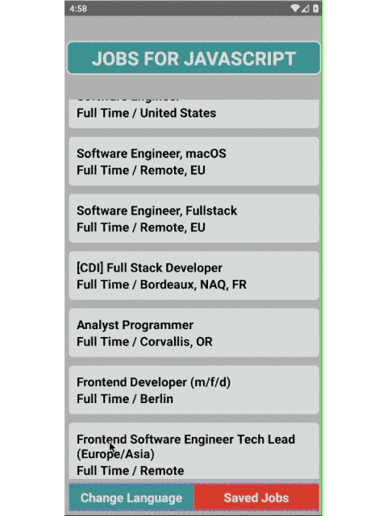

#JobSearchApp

  <h1 align="center">JOB SEARCHING APP</h1>
<p align="center" >



</p>
<p align="center">Iphone 12 (Emulator)<p>

<hr/>

<p align="center" >



</p>
<p align="center">Samsung Galaxy S10 (Emulator)<p>
<hr/>

<!-- TABLE OF CONTENTS -->
<details open="open">
  <summary>Table of Contents</summary>
  <ol>
    <li><a href="#about-the-project">About The Project</a></li>
    <li><a href="#built-with">Built With</a></li>
    <li><a href="#reviewed-topics">Reviewed Topics</a></li>
    <li><a href="#source-map">Source Map</a></li>
    <li><a href="#clone-the-repo">Clone The Repo</a></li>
    <li><a href="#contributing">Contributing</a></li>
    <li><a href="#contact">Contact</a></li>
    
  </ol>
</details>

<!-- ABOUT THE PROJECT -->

## About The Project

<h3>This project is a practice example of React Native.</h3>

<p>It is a prototype of a Demo Job Searching App project. I used GitHub Jobs API that provides real job opportunities for developers. The App consists of 3 pages. The first page is for users to pick their preferred programming language to check available jobs. Besides, it is possible to go directly to the saved jobs page which contains users' saved job preferences from the previous entrance.</p>
<p>The second page displays available jobs in tiny descriptive cards. These data are fetched from API regarding the chosen programming language by the user. If the user clicks on the cards then a modal card shows up to display a bit more information about the chosen job item. At this model page, the user could go to the regarding web page to see full details about the job and to apply, or save this job in his mobile phone to keep it for his is/her future consideration. On the other hand, it is also possible to skip the modal card by click out of the card area. </p>
<p> The third page displays the previously saved job items. On this page, it is also possible to open the model card by click on job items to see details of the chosen job also to remove it from the saved jobs list.</p>

## Built With

- [React Native](https://reactnative.dev/) 

## Reviewed Topics

- React Native;

  - Functional Components,
  - Custom Components,
  - React Native Built-in Components,
  - To style components and pages by using unified style sheet.

- React;

  - useState, useEffect Hooks,
  - props pass functions,

- Data Storage;

  - Async local storage

- Fetching Data;

  - Fetching data from rest api by using Axios library

- Pagination;

  - Used stack navigation by implementing React Navigation
  - Used animated modal page by implementing React Native Modal from Community

- Third Party Libraries;

  - axios
  - react-native-async-storage/async-storage
  - react-navigation/native
  - react-navigation/stack
  - moment.js
  - react-native-modal

- Used API Endpoints;
  - <url>https://jobs.github.com/positions.json</url>

## Source Map

<pre>
JobSearch
        |
        |- src
            |- assets
            |- components
            |           |- index.js
            |           |- Banner.js
            |           |- FloatButton.js
            |           |- JobItem.js
            |           |- JobModal.js
            |           |- TopicItem.js
            |           |- TouchButton.js
            |
            |- pages
            |      |- index.js
            |      |- Introduction.js
            |      |- Jobs.js
            |      |- SavedJobs.js
            |
            |- Router.js
            |- styles.js
   
</pre>

## Clone The Repo

```sh
git clone https://github.com/Hasan-Metin/StoreApp.git
```

To install dependencies run these CLI commands in JobSearch folder:

```sh
yarn install
```

or

```sh
npm install
```

If you use macOS

```sh
npx pod-install ios && cd ios && pod install && cd ..
```

## Contributing

Contributions are what make the open source community such an amazing place to be learn, inspire, and create. Any contributions you make are **greatly appreciated**.

1. Fork the Project
2. Create your Feature Branch (`git checkout -b feature/AmazingFeature`)
3. Commit your Changes (`git commit -m 'Add some AmazingFeature'`)
4. Push to the Branch (`git push origin feature/AmazingFeature`)
5. Open a Pull Request

## Contact

Hasan Metin - <a href="mailto: hasan.metinn@outlook.com">hasan.metinn@outlook.com</a>

Project Link: <url>https://github.com/Hasan-Metin/JobSearchApp.git<url>

<!-- ACKNOWLEDGEMENTS -->

More features will be added on soon.

If you have any question or suggestion, feel free to [open an issue](https://github.com/Hasan-Metin/JobSearchApp/issues).

**See y'all !**
